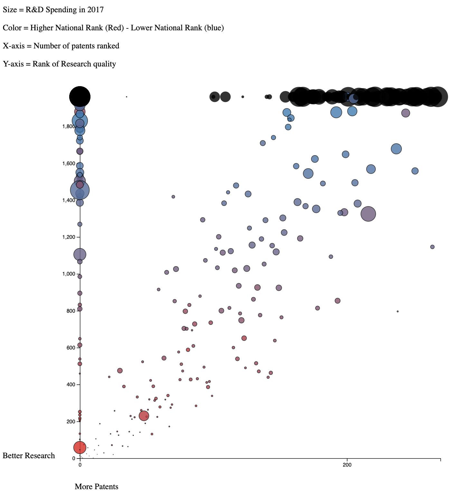
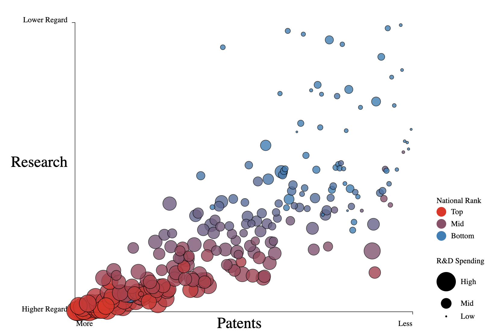
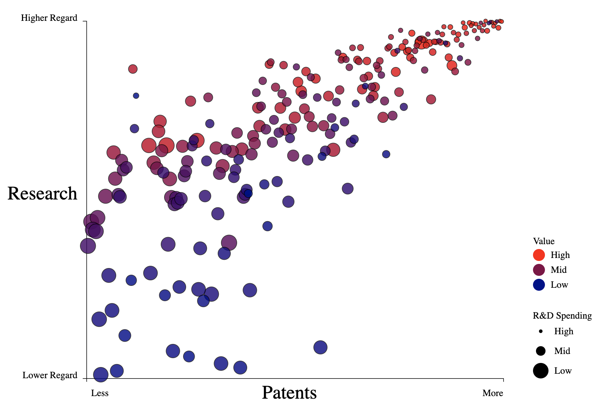

# Efficient R&D
### [Final Visualization](https://justinkraus.github.io/uni/)

Comparing University Research and Development Output with Spending. 

## Background
I read dozens of academic papers during my thesis research and noticed a lot of papers feature a "cited by" number. The number of citations refers to the number of other academic papers it has been cited by, this could be interpreted as a measure of influence. This statistic inspired an analysis to determine what are the most research influential universities and how well they spend their research budgets.

The final analysis compares university research spending, rank, and number of university patents.

## Data
The final visual compares data from three sources:

University Research Rankings: [Center for World University Rankings](https://cwur.org/2020-21.php)
University Patents: [US Patent Office Tracker of University Patents Since 1969](https://developer.uspto.gov/visualization/university-patent-count-expenditures)
University R&D Budgets: [National Science Foundation R&D Spending by University 2017](https://ncsesdata.nsf.gov/profiles/site?method=rankingBySource&ds=herd)

A lot of work was done to standardize university names across the datasets as each dataset had slightly different ways to refer to the same university. Additionally the US Patent Office aggregates statewide public universities into a single entity (for example, all of the University of California schools are counted as a single entity). Also you'll notice this doesn't include a comparison with the "cited by" number mentioned earlier, once I found the World University Rankings were already evaluating research programs that includes number of citations I decided to use their data.

## Visualization
### Iteration One
Also includes overall university ranking which was ultimately dropped from later versions. One thing that is apparent from this is that there is an overall pattern that correlates with the rankings and size (however there are some obvious outliers). The concentration of black circles on the perimeter indicates universities that were missing from 1 or more of the datasets and therefore they could not be positioned or colored correctly.

### Iteration Two
* Rankings are used in place of actual values to better distribute the points as there were previously overlapping clusters due to similar values in certain places making the chart unreadable. 
* The flip radius button is added to pick out individual universities where they overlap.

### Final
* Incorporates cleaning up of values to focus on a selection of approximately 230 universities that are present in all three datasets. 
* Color now shows value ranking, calculated as (Patents + Research Rank) / Cost,  to highlight the focus of the analysis. 

## Final Observations
There is a strong correlation between R&D spending with number of patents and ranking of research programs. However, outliers do exist and it would be most interesting to investigate the universities that don't spend a lot but do have strong programs to understand how their approaches can be replicated.